# PROGRESS

Living log of execution against `ROADMAP.md`. Updated after every phase commit.

> **Legend:** ✅ done · ⏳ in progress · 🔲 pending · ⏭️ deferred to cut list

---

## Phase flow

```mermaid
flowchart LR
    classDef done fill:#22c55e,color:#fff,stroke:#16a34a,stroke-width:2px
    classDef wip fill:#f59e0b,color:#fff,stroke:#d97706,stroke-width:2px
    classDef pending fill:#e5e7eb,color:#374151,stroke:#9ca3af

    subgraph D0[Day 0 — Foundation]
      P01[0.1 Repo bootstrap]
      P02[0.2 Docker + envs]
      P03[0.3 API skeleton]
      P04[0.4 Prisma + migration]
      P05[0.5 Web skeleton]
      P06[0.6 Shared schemas pkg]
    end

    subgraph D1[Day 1 — Core features]
      P11[1.1 Auth E2E]
      P12[1.2 Workspaces + invites]
      P13[1.3 Goals + milestones]
      P14[1.4 Action items + kanban]
      P15[1.5 Announcements + comments]
    end

    subgraph D2[Day 2 — Realtime, advanced, deploy]
      P21[2.1 Realtime wiring]
      P22[2.2 Mentions + notifications]
      P23[2.3 Analytics + CSV]
      P24[2.4 Optimistic UI]
      P25[2.5 Audit log]
      P26[2.6 Dark + cmdK]
      P27[2.7 Swagger]
      P28[2.8 Polish]
      P29[2.9 Deploy + seed]
      P210[2.10 README + video]
    end

    P01 --> P02 --> P03 --> P04 --> P05 --> P06
    P06 --> P11 --> P12 --> P13 --> P14 --> P15
    P15 --> P21 --> P22 --> P23 --> P24 --> P25
    P25 --> P26 --> P27 --> P28 --> P29 --> P210

    class P01,P02,P03,P04,P06,P11 done
    class P05 wip
    class P12,P13,P14,P15,P21,P22,P23,P24,P25,P26,P27,P28,P29,P210 pending
```



---

## Phase 0.1 + 0.2 — Repo bootstrap & Docker ✅

**Commit:** `1bc836b` — `chore(repo): bootstrap turborepo monorepo`

**What we did:**
1. Initialized git on `main`, set repo-local author identity.
2. Verified npm-latest for the locked stack; bumped CLAUDE.md table for Tiptap 3 / Recharts 3 / Sonner 2.
3. Wrote root `package.json`, `pnpm-workspace.yaml`, `turbo.json` (Turbo 2 task syntax).
4. Wrote root tooling: `.gitignore`, `.editorconfig`, `.prettierrc.json` (+ tailwind plugin), `.prettierignore`, `.nvmrc` (Node 22).
5. Scaffolded 5 workspace folders: `apps/api`, `apps/web`, `packages/{schemas,eslint-config,prettier-config}` with placeholder `package.json` + workspace links.
6. Wrote shared ESLint flat configs (`base`/`node`/`next`) and Prettier config in `packages/`.
7. `docker-compose.yml` — Postgres 16 (named volume) + maildev (opt-in via `--profile mail`).
8. `.env.example` for both apps with all required keys.
9. Added `README.md` overview pointing at the four spec docs.

**Verified:** `pnpm install` resolves all 6 workspaces; `pnpm list -r --depth -1` lists root + api + web + 3 packages.

**Files added** (27 files, 3088 insertions):
- root configs (8): `package.json`, `pnpm-workspace.yaml`, `turbo.json`, `.gitignore`, `.editorconfig`, `.prettierrc.json`, `.prettierignore`, `.nvmrc`
- workspace placeholders (10): `apps/{api,web}/package.json`, `apps/{api,web}/.env.example`, `packages/*/package.json`, `packages/eslint-config/{base,node,next}.js`, `packages/prettier-config/index.json`, `packages/schemas/src/index.js`
- infra (1): `docker-compose.yml`
- docs (5): `README.md`, `Claude.md`, `requirements.md`, `ARCHITECTURE.md`, `ROADMAP.md`

---

## Phase 0.3 — API skeleton ✅

**Commit:** `b207371` — `feat(api): bootstrap express server with health check`

**Sub-steps:**
1. Generated 64-char hex JWT access + refresh secrets via `crypto.randomBytes(32)`, wrote them into gitignored `apps/api/.env`.
2. Brought up Postgres via `docker compose up -d db` (healthy, port 5432).
3. Installed Phase 0.3 runtime deps: `express@^5.2.1`, `helmet@^8.1.0`, `cors@^2.8.5`, `cookie-parser@^1.4.7`, `zod@^4.4.1`, `pino@^10.3.1`, `pino-http@^11.0.0`, `pino-pretty@^13.1.3`.
4. Wrote `src/env.js` — Zod-validated env loader; preprocesses `'' → undefined` so `.env` empty fields don't break optional coercions; throws on boot if invalid.
5. Wrote `src/lib/errors.js` — `AppError` class + named factories (`BadRequest`, `Unauthorized`, `Forbidden`, `NotFound`, `Conflict`, `Gone`, `Validation`).
6. Wrote `src/lib/logger.js` — pino with redact paths for cookies, auth headers, password fields, `*.email`; pino-pretty in dev only.
7. Wrote `src/middleware/error.js` — envelope formatter for `ZodError` → 422, `AppError` → mapped status, fallback → 500 (no stack in prod per CLAUDE.md §9).
8. Wrote `src/app.js` — Express 5 app: helmet, CORS allowlisted to `CLIENT_URL` with `credentials:true`, JSON 1mb, cookieParser, pino-http (skips `/health` log noise), `GET /health`, then 404 + error handlers last.
9. Wrote `src/server.js` — `http.createServer` + listen + graceful SIGINT/SIGTERM with 10s force-kill timer + unhandledRejection/uncaughtException hooks.
10. Wrote `apps/api/eslint.config.js` re-exporting `@team-hub/eslint-config/node`.

**Verified by user:**
```
$ curl -i http://localhost:4000/health
HTTP/1.1 200 OK
{"ok":true,"name":"@team-hub/api","version":"0.1.0","env":"development","uptimeSec":36}

$ curl -i http://localhost:4000/nope
HTTP/1.1 404 Not Found
{"error":{"code":"NOT_FOUND","message":"Route GET /nope not found"}}
```
All Helmet headers present (CSP, HSTS, X-Frame-Options, …); CORS scoped to `http://localhost:3000` with `Access-Control-Allow-Credentials: true`.

**Boot bug found and fixed:** `SMTP_PORT=` (empty) was coerced to `0` and failed `.positive()`. Fix: top-level preprocessor in `env.js` maps `'' → undefined` for all keys before validation.

---

## Phase 0.4 — Prisma schema + initial migration ✅

**Migration:** `20260501105147_init` applied; 15 tables created (14 models + `_prisma_migrations`).

**Files written:**
- `apps/api/prisma/schema.prisma` — full schema per ARCHITECTURE.md §4 (5 enums + 14 models with compound indexes).
- `apps/api/src/db.js` — `PrismaClient` singleton with `@prisma/adapter-pg` + hot-reload guard for `node --watch`.
- `apps/api/prisma/seed.js` — no-op shell until Phase 1.x.

**Sub-steps done:**
1. Hit Node-version blocker on `prisma` dev install (Prisma 7 needs Node ≥ 22.12, local was 22.2). Resolved via `brew upgrade node@22` → 22.22.2.
2. Installed `@prisma/client@^7.8.0`, `@prisma/adapter-pg@^7.8.0`, `pg@^8.13.1` as runtime; `prisma@^7.8.0` as dev.
3. Wrote schema + db.js + seed.js.
4. Hit Prisma 7 schema break: `url` is no longer allowed in `datasource db { … }`. Moved it to a new `apps/api/prisma.config.js` (using `defineConfig` from `prisma/config`) and installed `dotenv` so that file can read `DATABASE_URL` from `apps/api/.env` at config-load time. Schema datasource block is now provider-only.

**Provider deviation from CLAUDE.md** (logged in CLAUDE.md + ARCHITECTURE.md):
CLAUDE.md initially specced the new `prisma-client` provider. After inspecting the installed CLI build (`prisma@7.8.0/build/index.js`), the provider registry is:
```
{ PrismaClientJs: "prisma-client-js",  PrismaClientTs: "prisma-client" }
```
The new `prisma-client` provider is TS-only (internally named `PrismaClientTs`) and would require a TS build step or `--experimental-strip-types` to consume from our pure-JS ESM backend. We use the **`prisma-client-js`** provider instead — still fully supported in Prisma 7, emits JS, works with `@prisma/adapter-pg` for the Rust-free driver path. CLAUDE.md and ARCHITECTURE.md updated to match.

**Verified by user:** `pnpm --filter @team-hub/api db:migrate --name init` ran clean; `\dt` returned all 15 expected tables (`ActionItem`, `Announcement`, `AuditLog`, `Comment`, `Goal`, `GoalUpdate`, `Invitation`, `Milestone`, `Notification`, `Reaction`, `RefreshToken`, `User`, `Workspace`, `WorkspaceMember`, `_prisma_migrations`). `prisma generate` emitted the JS client to `apps/api/src/generated/prisma/`. Seed no-op fired.

---

## Phase 0.6 — Shared Zod schemas package ✅

**Done out of roadmap order** (before 0.5) so Phase 1.1 auth and the future React Hook Form resolvers both consume the same Zod from day one — single source of truth across api + web.

**Files written under `packages/schemas/src/`:**
- `enums.js` — Zod enums mirroring Prisma's `Role`, `GoalStatus`, `ItemStatus`, `Priority`, `AuditAction` + plain-array exports for kanban column iteration.
- `auth.js` — `registerSchema`, `loginSchema`, `updateProfileSchema` (per REQUIREMENTS §B: ≥8 chars, ≥1 letter, ≥1 number; emails normalized via `.toLowerCase()` and `.trim()`).
- `workspace.js` — workspace CRUD + member role + invitation create/accept (hex accent color regex, role enum from `enums.js`).
- `goal.js` — goal CRUD, milestone CRUD, goal-update create, paginated list query.
- `action-item.js` — action-item CRUD, list query with kanban filters.
- `announcement.js` — announcement CRUD (Tiptap HTML — sanitize-html still runs server-side per CLAUDE.md §1.7), reaction toggle, comment create + cursor pagination.
- `index.js` — barrel re-export so both apps `import { registerSchema, … } from '@team-hub/schemas'`.

`packages/schemas/package.json` already declares `zod` as a peerDependency, so the consuming app's `zod` (api: ^4.4.1; web: TBD in Phase 0.5) is what gets used — no duplicate install.

---

## Phase 1.1 — Auth end-to-end (backend) ✅

**Files written under `apps/api/src/`:**
- `lib/tokens.js` — `signAccess` / `verifyAccess` / `signRefresh` (with random `jti`) / `verifyRefresh` / `hashRefresh` (sha256).
- `lib/cookies.js` — `setAccessCookie` / `setRefreshCookie` / `clearAuthCookies`. `at` Path=/ for 15m, `rt` Path=/auth for 30d. `httpOnly` always; `secure` only in prod; `sameSite=lax`.
- `middleware/auth.js` — `requireAuth` reads `at` cookie, verifies JWT, attaches `req.user.id`.
- `middleware/validate.js` — generic Zod body/query/params validator; ZodError flows to error handler → 422.
- `middleware/rate-limit.js` — `authLimiter` 10/min/ip on `/auth/*`.
- `modules/auth/{service,controller,router}.js` — register / login / refresh / logout / me. Refresh rotation runs in `prisma.$transaction` so revoke-old + issue-new is atomic.
- `modules/users/{controller,router}.js` — `PATCH /users/me` (avatar route deferred until Cloudinary keys are configured).

**Wired in `app.js`:** `/auth` → `authRouter`, `/users` → `usersRouter`, before the 404/error handlers.

**Three deviations / fixes during the phase:**
1. **`bcrypt` → `bcryptjs`.** After `brew upgrade node@22` to 22.22.2, the prebuilt `bcrypt.node` was linked against the old icu4c library that brew removed; native `.node` binaries are version-fragile in general. `bcryptjs` is pure JS, same async API, ~30% slower per hash but we hash on register/login only.
2. **`.npmrc` with `public-hoist-pattern[]=*@prisma/*`.** Prisma 7's generated client at `apps/api/src/generated/prisma/runtime/client.js` does flat `require('@prisma/client-runtime-utils')`. pnpm normally nests transitives under their parent, so this require fails. Hoisting all `@prisma/*` to the workspace root resolves it cleanly. Did a clean `node_modules` reinstall to apply.
3. **`signRefresh` adds a random `jti` claim.** Without it, a refresh JWT signed for the same user within the same second produced a byte-identical token → byte-identical sha256 → `RefreshToken.tokenHash` unique-constraint violation. The 16-byte random `jti` makes each refresh token unique.

**Verified by user (9/9 curl steps pass):**
| Step | Expected | Got |
|------|----------|-----|
| `POST /auth/register` (good payload) | 201 + at/rt cookies | ✅ 201 |
| `GET /auth/me` (with at cookie) | 200 user | ✅ 200 |
| `POST /auth/login` (bad password) | 401 generic | ✅ 401 |
| `POST /auth/login` (good) | 200 + new cookies | ✅ 200 |
| `POST /auth/refresh` | 200 + rotated rt | ✅ 200 (new jti confirmed) |
| `PATCH /users/me` | 200 updated user | ✅ 200 |
| `POST /auth/logout` | 204 + cleared cookies | ✅ 204 |
| `GET /auth/me` (after logout) | 401 | ✅ 401 |
| `POST /auth/register` (weak password) | 422 + Zod field errors | ✅ 422 |

**Known follow-ups (not blockers):**
- Wrap `registerUser` in `$transaction` so a refresh-token persist failure rolls back the user create.
- `POST /users/me/avatar` stubbed pending Cloudinary keys.

---

## Session handoff (for the next Claude session)

**Repo state at session end:** commits up to Phase 0.6 done. Local Postgres healthy via `docker compose up -d db`. `apps/api/.env` has working JWT secrets (gitignored). Migration `20260501105147_init` applied; all 14 tables present.

**Memory loaded automatically into next session:**
- `MEMORY.md` index points to 8 memory files: user role (frontend eng learning backend), assessment context (deadline 2026-05-04, demo creds, GitHub URL), version bumps (Tiptap 3 / Recharts 3 / Sonner 2), and 5 feedback memories (concise commits / no auto-push / surface silent config / user runs dev commands / maintain PROGRESS.md).

**Next session starts here — Phase 0.5 (Web skeleton):**

The backend now has working auth at `http://localhost:4000`. Time to build the Next.js shell that consumes it.

1. **Install** in `apps/web`: `next@^16.2.4`, `react@^19`, `react-dom@^19`, `tailwindcss@^4`, `@tailwindcss/postcss@^4`, `zustand@^5`, `@tanstack/react-query@^5`, `socket.io-client@^4.8.3`, `axios@^1`, `react-hook-form@^7`, `@hookform/resolvers`, `zod@^4`, `next-themes@^0.4`, `sonner@^2`, `lucide-react`, `clsx`, `tailwind-merge`, `class-variance-authority@^0.7`. Tiptap/Recharts/dnd-kit later when needed.
2. **App scaffold** under `apps/web/src/app/`:
   - `layout.jsx`, `globals.css` (Tailwind v4 entry: `@import "tailwindcss";`), `providers.jsx` (TanStack Query + ThemeProvider + Sonner Toaster), `page.jsx` (redirect to `/login`).
   - Route groups `(auth)/login/page.jsx` and `(auth)/register/page.jsx` using `react-hook-form` + Zod resolvers from `@team-hub/schemas` (`registerSchema`, `loginSchema`).
   - `(app)/layout.jsx` calls `/auth/me` server-side and redirects to `/login` if 401.
3. **`apps/web/src/lib/`**:
   - `api.js` — axios instance, `withCredentials: true`, `baseURL: NEXT_PUBLIC_API_URL`. 401 interceptor calls `/auth/refresh` once, retries the original request, otherwise redirects to `/login`.
   - `socket.js` — socket.io factory keyed by workspace.
   - `cn.js` — clsx + tailwind-merge.
4. **next.config.mjs**, **jsconfig.json** with `@/*` alias, **eslint.config.js** re-exporting `@team-hub/eslint-config/next`.
5. **Verify**: `pnpm --filter @team-hub/web dev` boots on :3000; `/login` form posts to API; on 200, redirected to `/workspaces` (empty for now).
6. Commit: `feat(web): bootstrap next 16 app router with tailwind v4` + `feat(web): add login and register flows`.

**Then** Phase 1.2 (Workspaces backend + frontend) → 1.3 (Goals) → 1.4 (Action items) → 1.5 (Announcements) → 2.x.

Cut list & time triggers (when behind): see `ROADMAP.md` "Cut list" and "Time triggers" sections.

See `ROADMAP.md` for the full execution plan and `requirements.md` §A for the locked decisions.
