# PROGRESS

Living log of execution against `ROADMAP.md`. Updated after every phase commit.

> **Legend:** ✅ done · ⏳ in progress · 🔲 pending · ⏭️ deferred to cut list

---

## Phase flow

```mermaid
flowchart LR
    classDef done fill:#22c55e,color:#fff,stroke:#16a34a,stroke-width:2px
    classDef wip fill:#f59e0b,color:#fff,stroke:#d97706,stroke-width:2px
    classDef pending fill:#e5e7eb,color:#374151,stroke:#9ca3af

    subgraph D0[Day 0 — Foundation]
      P01[0.1 Repo bootstrap]
      P02[0.2 Docker + envs]
      P03[0.3 API skeleton]
      P04[0.4 Prisma + migration]
      P05[0.5 Web skeleton]
      P06[0.6 Shared schemas pkg]
    end

    subgraph D1[Day 1 — Core features]
      P11[1.1 Auth E2E]
      P12[1.2 Workspaces + invites]
      P13[1.3 Goals + milestones]
      P14[1.4 Action items + kanban]
      P15[1.5 Announcements + comments]
    end

    subgraph D2[Day 2 — Realtime, advanced, deploy]
      P21[2.1 Realtime wiring]
      P22[2.2 Mentions + notifications]
      P23[2.3 Analytics + CSV]
      P24[2.4 Optimistic UI]
      P25[2.5 Audit log]
      P26[2.6 Dark + cmdK]
      P27[2.7 Swagger]
      P28[2.8 Polish]
      P29[2.9 Deploy + seed]
      P210[2.10 README + video]
    end

    P01 --> P02 --> P03 --> P04 --> P05 --> P06
    P06 --> P11 --> P12 --> P13 --> P14 --> P15
    P15 --> P21 --> P22 --> P23 --> P24 --> P25
    P25 --> P26 --> P27 --> P28 --> P29 --> P210

    class P01,P02,P03 done
    class P04 wip
    class P05,P06,P11,P12,P13,P14,P15,P21,P22,P23,P24,P25,P26,P27,P28,P29,P210 pending
```



---

## Phase 0.1 + 0.2 — Repo bootstrap & Docker ✅

**Commit:** `1bc836b` — `chore(repo): bootstrap turborepo monorepo`

**What we did:**
1. Initialized git on `main`, set repo-local author identity.
2. Verified npm-latest for the locked stack; bumped CLAUDE.md table for Tiptap 3 / Recharts 3 / Sonner 2.
3. Wrote root `package.json`, `pnpm-workspace.yaml`, `turbo.json` (Turbo 2 task syntax).
4. Wrote root tooling: `.gitignore`, `.editorconfig`, `.prettierrc.json` (+ tailwind plugin), `.prettierignore`, `.nvmrc` (Node 22).
5. Scaffolded 5 workspace folders: `apps/api`, `apps/web`, `packages/{schemas,eslint-config,prettier-config}` with placeholder `package.json` + workspace links.
6. Wrote shared ESLint flat configs (`base`/`node`/`next`) and Prettier config in `packages/`.
7. `docker-compose.yml` — Postgres 16 (named volume) + maildev (opt-in via `--profile mail`).
8. `.env.example` for both apps with all required keys.
9. Added `README.md` overview pointing at the four spec docs.

**Verified:** `pnpm install` resolves all 6 workspaces; `pnpm list -r --depth -1` lists root + api + web + 3 packages.

**Files added** (27 files, 3088 insertions):
- root configs (8): `package.json`, `pnpm-workspace.yaml`, `turbo.json`, `.gitignore`, `.editorconfig`, `.prettierrc.json`, `.prettierignore`, `.nvmrc`
- workspace placeholders (10): `apps/{api,web}/package.json`, `apps/{api,web}/.env.example`, `packages/*/package.json`, `packages/eslint-config/{base,node,next}.js`, `packages/prettier-config/index.json`, `packages/schemas/src/index.js`
- infra (1): `docker-compose.yml`
- docs (5): `README.md`, `Claude.md`, `requirements.md`, `ARCHITECTURE.md`, `ROADMAP.md`

---

## Phase 0.3 — API skeleton ✅

**Commit:** `b207371` — `feat(api): bootstrap express server with health check`

**Sub-steps:**
1. Generated 64-char hex JWT access + refresh secrets via `crypto.randomBytes(32)`, wrote them into gitignored `apps/api/.env`.
2. Brought up Postgres via `docker compose up -d db` (healthy, port 5432).
3. Installed Phase 0.3 runtime deps: `express@^5.2.1`, `helmet@^8.1.0`, `cors@^2.8.5`, `cookie-parser@^1.4.7`, `zod@^4.4.1`, `pino@^10.3.1`, `pino-http@^11.0.0`, `pino-pretty@^13.1.3`.
4. Wrote `src/env.js` — Zod-validated env loader; preprocesses `'' → undefined` so `.env` empty fields don't break optional coercions; throws on boot if invalid.
5. Wrote `src/lib/errors.js` — `AppError` class + named factories (`BadRequest`, `Unauthorized`, `Forbidden`, `NotFound`, `Conflict`, `Gone`, `Validation`).
6. Wrote `src/lib/logger.js` — pino with redact paths for cookies, auth headers, password fields, `*.email`; pino-pretty in dev only.
7. Wrote `src/middleware/error.js` — envelope formatter for `ZodError` → 422, `AppError` → mapped status, fallback → 500 (no stack in prod per CLAUDE.md §9).
8. Wrote `src/app.js` — Express 5 app: helmet, CORS allowlisted to `CLIENT_URL` with `credentials:true`, JSON 1mb, cookieParser, pino-http (skips `/health` log noise), `GET /health`, then 404 + error handlers last.
9. Wrote `src/server.js` — `http.createServer` + listen + graceful SIGINT/SIGTERM with 10s force-kill timer + unhandledRejection/uncaughtException hooks.
10. Wrote `apps/api/eslint.config.js` re-exporting `@team-hub/eslint-config/node`.

**Verified by user:**
```
$ curl -i http://localhost:4000/health
HTTP/1.1 200 OK
{"ok":true,"name":"@team-hub/api","version":"0.1.0","env":"development","uptimeSec":36}

$ curl -i http://localhost:4000/nope
HTTP/1.1 404 Not Found
{"error":{"code":"NOT_FOUND","message":"Route GET /nope not found"}}
```
All Helmet headers present (CSP, HSTS, X-Frame-Options, …); CORS scoped to `http://localhost:3000` with `Access-Control-Allow-Credentials: true`.

**Boot bug found and fixed:** `SMTP_PORT=` (empty) was coerced to `0` and failed `.positive()`. Fix: top-level preprocessor in `env.js` maps `'' → undefined` for all keys before validation.

---

## Phase 0.4 — Prisma schema + initial migration ⏳

**Plan:**
1. **Install:** `@prisma/client@^7.8.0`, `@prisma/adapter-pg@^7.8.0`, `pg`; dev `prisma@^7.8.0`.
2. **Schema (`apps/api/prisma/schema.prisma`):** copy of `ARCHITECTURE.md §4`. Generator uses Prisma 7's new `prisma-client` provider (ESM, Rust-free), output to `../src/generated/prisma/`. IDs use `cuid()` (v1, matches doc). 14 models: User, RefreshToken, Workspace, WorkspaceMember, Invitation, Goal, Milestone, GoalUpdate, ActionItem, Announcement, Reaction, Comment, Notification, AuditLog. Compound indexes for analytics + filter predicates already specced.
3. **Singleton (`apps/api/src/db.js`):** `new PrismaClient({ adapter: new PrismaPg({ connectionString }) })` with hot-reload guard for `node --watch`. Exports `prisma` + `disconnect()`.
4. **Seed shell (`apps/api/prisma/seed.js`):** logs "no-op" until Phase 1.x fills it in.
5. **User runs:** `pnpm --filter @team-hub/api db:migrate --name init` — creates `prisma/migrations/<ts>_init/migration.sql`, applies it, runs `prisma generate`.
6. **Commit:** `feat(api): add prisma schema and initial migration`.

**Expected verification (user runs):**
```bash
docker exec -it team-hub-db psql -U team_hub -d team_hub -c "\dt"
# Should list: User, RefreshToken, Workspace, WorkspaceMember, Invitation,
# Goal, Milestone, GoalUpdate, ActionItem, Announcement, Reaction, Comment,
# Notification, AuditLog, _prisma_migrations
```

---

## Up next

- Phase 0.5 — Web skeleton (Next 16 + Tailwind v4 + providers + axios refresh interceptor)
- Phase 0.6 — Shared Zod schemas package
- Phase 1.1 — Auth end-to-end

See `ROADMAP.md` for the full execution plan and `requirements.md` §A for the locked decisions and cut list.
