# PROGRESS

Living log of execution against `ROADMAP.md`. Updated after every phase commit.

> **Legend:** ✅ done · ⏳ in progress · 🔲 pending · ⏭️ deferred to cut list

---

## Phase flow

```mermaid
flowchart LR
    classDef done fill:#22c55e,color:#fff,stroke:#16a34a,stroke-width:2px
    classDef wip fill:#f59e0b,color:#fff,stroke:#d97706,stroke-width:2px
    classDef pending fill:#e5e7eb,color:#374151,stroke:#9ca3af

    subgraph D0[Day 0 — Foundation]
      P01[0.1 Repo bootstrap]
      P02[0.2 Docker + envs]
      P03[0.3 API skeleton]
      P04[0.4 Prisma + migration]
      P05[0.5 Web skeleton]
      P06[0.6 Shared schemas pkg]
    end

    subgraph D1[Day 1 — Core features]
      P11[1.1 Auth E2E]
      P12[1.2 Workspaces + invites]
      P13[1.3 Goals + milestones]
      P14[1.4 Action items + kanban]
      P15[1.5 Announcements + comments]
    end

    subgraph D2[Day 2 — Realtime, advanced, deploy]
      P21[2.1 Realtime wiring]
      P22[2.2 Mentions + notifications]
      P23[2.3 Analytics + CSV]
      P24[2.4 Optimistic UI]
      P25[2.5 Audit log]
      P26[2.6 Dark + cmdK]
      P27[2.7 Swagger]
      P28[2.8 Polish]
      P29[2.9 Deploy + seed]
      P210[2.10 README + video]
    end

    P01 --> P02 --> P03 --> P04 --> P05 --> P06
    P06 --> P11 --> P12 --> P13 --> P14 --> P15
    P15 --> P21 --> P22 --> P23 --> P24 --> P25
    P25 --> P26 --> P27 --> P28 --> P29 --> P210

    class P01,P02,P03,P04,P06,P11,P12,P13,P14,P15,P21,P22,P23,P25,P27 done
    class P05,P24,P26,P28,P29,P210 pending
```



---

## Phase 0.1 + 0.2 — Repo bootstrap & Docker ✅

**Commit:** `1bc836b` — `chore(repo): bootstrap turborepo monorepo`

**What we did:**
1. Initialized git on `main`, set repo-local author identity.
2. Verified npm-latest for the locked stack; bumped CLAUDE.md table for Tiptap 3 / Recharts 3 / Sonner 2.
3. Wrote root `package.json`, `pnpm-workspace.yaml`, `turbo.json` (Turbo 2 task syntax).
4. Wrote root tooling: `.gitignore`, `.editorconfig`, `.prettierrc.json` (+ tailwind plugin), `.prettierignore`, `.nvmrc` (Node 22).
5. Scaffolded 5 workspace folders: `apps/api`, `apps/web`, `packages/{schemas,eslint-config,prettier-config}` with placeholder `package.json` + workspace links.
6. Wrote shared ESLint flat configs (`base`/`node`/`next`) and Prettier config in `packages/`.
7. `docker-compose.yml` — Postgres 16 (named volume) + maildev (opt-in via `--profile mail`).
8. `.env.example` for both apps with all required keys.
9. Added `README.md` overview pointing at the four spec docs.

**Verified:** `pnpm install` resolves all 6 workspaces; `pnpm list -r --depth -1` lists root + api + web + 3 packages.

**Files added** (27 files, 3088 insertions):
- root configs (8): `package.json`, `pnpm-workspace.yaml`, `turbo.json`, `.gitignore`, `.editorconfig`, `.prettierrc.json`, `.prettierignore`, `.nvmrc`
- workspace placeholders (10): `apps/{api,web}/package.json`, `apps/{api,web}/.env.example`, `packages/*/package.json`, `packages/eslint-config/{base,node,next}.js`, `packages/prettier-config/index.json`, `packages/schemas/src/index.js`
- infra (1): `docker-compose.yml`
- docs (5): `README.md`, `Claude.md`, `requirements.md`, `ARCHITECTURE.md`, `ROADMAP.md`

---

## Phase 0.3 — API skeleton ✅

**Commit:** `b207371` — `feat(api): bootstrap express server with health check`

**Sub-steps:**
1. Generated 64-char hex JWT access + refresh secrets via `crypto.randomBytes(32)`, wrote them into gitignored `apps/api/.env`.
2. Brought up Postgres via `docker compose up -d db` (healthy, port 5432).
3. Installed Phase 0.3 runtime deps: `express@^5.2.1`, `helmet@^8.1.0`, `cors@^2.8.5`, `cookie-parser@^1.4.7`, `zod@^4.4.1`, `pino@^10.3.1`, `pino-http@^11.0.0`, `pino-pretty@^13.1.3`.
4. Wrote `src/env.js` — Zod-validated env loader; preprocesses `'' → undefined` so `.env` empty fields don't break optional coercions; throws on boot if invalid.
5. Wrote `src/lib/errors.js` — `AppError` class + named factories (`BadRequest`, `Unauthorized`, `Forbidden`, `NotFound`, `Conflict`, `Gone`, `Validation`).
6. Wrote `src/lib/logger.js` — pino with redact paths for cookies, auth headers, password fields, `*.email`; pino-pretty in dev only.
7. Wrote `src/middleware/error.js` — envelope formatter for `ZodError` → 422, `AppError` → mapped status, fallback → 500 (no stack in prod per CLAUDE.md §9).
8. Wrote `src/app.js` — Express 5 app: helmet, CORS allowlisted to `CLIENT_URL` with `credentials:true`, JSON 1mb, cookieParser, pino-http (skips `/health` log noise), `GET /health`, then 404 + error handlers last.
9. Wrote `src/server.js` — `http.createServer` + listen + graceful SIGINT/SIGTERM with 10s force-kill timer + unhandledRejection/uncaughtException hooks.
10. Wrote `apps/api/eslint.config.js` re-exporting `@team-hub/eslint-config/node`.

**Verified by user:**
```
$ curl -i http://localhost:4000/health
HTTP/1.1 200 OK
{"ok":true,"name":"@team-hub/api","version":"0.1.0","env":"development","uptimeSec":36}

$ curl -i http://localhost:4000/nope
HTTP/1.1 404 Not Found
{"error":{"code":"NOT_FOUND","message":"Route GET /nope not found"}}
```
All Helmet headers present (CSP, HSTS, X-Frame-Options, …); CORS scoped to `http://localhost:3000` with `Access-Control-Allow-Credentials: true`.

**Boot bug found and fixed:** `SMTP_PORT=` (empty) was coerced to `0` and failed `.positive()`. Fix: top-level preprocessor in `env.js` maps `'' → undefined` for all keys before validation.

---

## Phase 0.4 — Prisma schema + initial migration ✅

**Migration:** `20260501105147_init` applied; 15 tables created (14 models + `_prisma_migrations`).

**Files written:**
- `apps/api/prisma/schema.prisma` — full schema per ARCHITECTURE.md §4 (5 enums + 14 models with compound indexes).
- `apps/api/src/db.js` — `PrismaClient` singleton with `@prisma/adapter-pg` + hot-reload guard for `node --watch`.
- `apps/api/prisma/seed.js` — no-op shell until Phase 1.x.

**Sub-steps done:**
1. Hit Node-version blocker on `prisma` dev install (Prisma 7 needs Node ≥ 22.12, local was 22.2). Resolved via `brew upgrade node@22` → 22.22.2.
2. Installed `@prisma/client@^7.8.0`, `@prisma/adapter-pg@^7.8.0`, `pg@^8.13.1` as runtime; `prisma@^7.8.0` as dev.
3. Wrote schema + db.js + seed.js.
4. Hit Prisma 7 schema break: `url` is no longer allowed in `datasource db { … }`. Moved it to a new `apps/api/prisma.config.js` (using `defineConfig` from `prisma/config`) and installed `dotenv` so that file can read `DATABASE_URL` from `apps/api/.env` at config-load time. Schema datasource block is now provider-only.

**Provider deviation from CLAUDE.md** (logged in CLAUDE.md + ARCHITECTURE.md):
CLAUDE.md initially specced the new `prisma-client` provider. After inspecting the installed CLI build (`prisma@7.8.0/build/index.js`), the provider registry is:
```
{ PrismaClientJs: "prisma-client-js",  PrismaClientTs: "prisma-client" }
```
The new `prisma-client` provider is TS-only (internally named `PrismaClientTs`) and would require a TS build step or `--experimental-strip-types` to consume from our pure-JS ESM backend. We use the **`prisma-client-js`** provider instead — still fully supported in Prisma 7, emits JS, works with `@prisma/adapter-pg` for the Rust-free driver path. CLAUDE.md and ARCHITECTURE.md updated to match.

**Verified by user:** `pnpm --filter @team-hub/api db:migrate --name init` ran clean; `\dt` returned all 15 expected tables (`ActionItem`, `Announcement`, `AuditLog`, `Comment`, `Goal`, `GoalUpdate`, `Invitation`, `Milestone`, `Notification`, `Reaction`, `RefreshToken`, `User`, `Workspace`, `WorkspaceMember`, `_prisma_migrations`). `prisma generate` emitted the JS client to `apps/api/src/generated/prisma/`. Seed no-op fired.

---

## Phase 0.6 — Shared Zod schemas package ✅

**Done out of roadmap order** (before 0.5) so Phase 1.1 auth and the future React Hook Form resolvers both consume the same Zod from day one — single source of truth across api + web.

**Files written under `packages/schemas/src/`:**
- `enums.js` — Zod enums mirroring Prisma's `Role`, `GoalStatus`, `ItemStatus`, `Priority`, `AuditAction` + plain-array exports for kanban column iteration.
- `auth.js` — `registerSchema`, `loginSchema`, `updateProfileSchema` (per REQUIREMENTS §B: ≥8 chars, ≥1 letter, ≥1 number; emails normalized via `.toLowerCase()` and `.trim()`).
- `workspace.js` — workspace CRUD + member role + invitation create/accept (hex accent color regex, role enum from `enums.js`).
- `goal.js` — goal CRUD, milestone CRUD, goal-update create, paginated list query.
- `action-item.js` — action-item CRUD, list query with kanban filters.
- `announcement.js` — announcement CRUD (Tiptap HTML — sanitize-html still runs server-side per CLAUDE.md §1.7), reaction toggle, comment create + cursor pagination.
- `index.js` — barrel re-export so both apps `import { registerSchema, … } from '@team-hub/schemas'`.

`packages/schemas/package.json` already declares `zod` as a peerDependency, so the consuming app's `zod` (api: ^4.4.1; web: TBD in Phase 0.5) is what gets used — no duplicate install.

---

## Phase 1.1 — Auth end-to-end (backend) ✅

**Files written under `apps/api/src/`:**
- `lib/tokens.js` — `signAccess` / `verifyAccess` / `signRefresh` (with random `jti`) / `verifyRefresh` / `hashRefresh` (sha256).
- `lib/cookies.js` — `setAccessCookie` / `setRefreshCookie` / `clearAuthCookies`. `at` Path=/ for 15m, `rt` Path=/auth for 30d. `httpOnly` always; `secure` only in prod; `sameSite=lax`.
- `middleware/auth.js` — `requireAuth` reads `at` cookie, verifies JWT, attaches `req.user.id`.
- `middleware/validate.js` — generic Zod body/query/params validator; ZodError flows to error handler → 422.
- `middleware/rate-limit.js` — `authLimiter` 10/min/ip on `/auth/*`.
- `modules/auth/{service,controller,router}.js` — register / login / refresh / logout / me. Refresh rotation runs in `prisma.$transaction` so revoke-old + issue-new is atomic.
- `modules/users/{controller,router}.js` — `PATCH /users/me` (avatar route deferred until Cloudinary keys are configured).

**Wired in `app.js`:** `/auth` → `authRouter`, `/users` → `usersRouter`, before the 404/error handlers.

**Three deviations / fixes during the phase:**
1. **`bcrypt` → `bcryptjs`.** After `brew upgrade node@22` to 22.22.2, the prebuilt `bcrypt.node` was linked against the old icu4c library that brew removed; native `.node` binaries are version-fragile in general. `bcryptjs` is pure JS, same async API, ~30% slower per hash but we hash on register/login only.
2. **`.npmrc` with `public-hoist-pattern[]=*@prisma/*`.** Prisma 7's generated client at `apps/api/src/generated/prisma/runtime/client.js` does flat `require('@prisma/client-runtime-utils')`. pnpm normally nests transitives under their parent, so this require fails. Hoisting all `@prisma/*` to the workspace root resolves it cleanly. Did a clean `node_modules` reinstall to apply.
3. **`signRefresh` adds a random `jti` claim.** Without it, a refresh JWT signed for the same user within the same second produced a byte-identical token → byte-identical sha256 → `RefreshToken.tokenHash` unique-constraint violation. The 16-byte random `jti` makes each refresh token unique.

**Verified by user (9/9 curl steps pass):**
| Step | Expected | Got |
|------|----------|-----|
| `POST /auth/register` (good payload) | 201 + at/rt cookies | ✅ 201 |
| `GET /auth/me` (with at cookie) | 200 user | ✅ 200 |
| `POST /auth/login` (bad password) | 401 generic | ✅ 401 |
| `POST /auth/login` (good) | 200 + new cookies | ✅ 200 |
| `POST /auth/refresh` | 200 + rotated rt | ✅ 200 (new jti confirmed) |
| `PATCH /users/me` | 200 updated user | ✅ 200 |
| `POST /auth/logout` | 204 + cleared cookies | ✅ 204 |
| `GET /auth/me` (after logout) | 401 | ✅ 401 |
| `POST /auth/register` (weak password) | 422 + Zod field errors | ✅ 422 |

**Known follow-ups (not blockers):**
- Wrap `registerUser` in `$transaction` so a refresh-token persist failure rolls back the user create.
- `POST /users/me/avatar` stubbed pending Cloudinary keys.

---

## Phase 1.2 — Workspaces, members, invitations (backend) ✅

**Files written:**
- `apps/api/src/middleware/workspace-role.js` — `requireWorkspaceMember()` and `requireWorkspaceRole(role)` factories. Each loads the `WorkspaceMember` row by `(workspaceId, userId)` and either attaches it as `req.workspaceMember` or rejects with `403`.
- `apps/api/src/lib/invitation-token.js` — `generateInviteToken()` (32 random bytes hex + sha256 hash + 7-day expiry) and `hashInviteToken()`. Raw token returned to admin once; only hash persisted.
- `apps/api/src/modules/workspaces/{service,controller,router}.js` — workspaces CRUD, members list/role/remove (with last-admin guard), invitations create/list, all admin-protected appropriately. Uses `prisma.$transaction` for create-with-membership and member role changes.
- `apps/api/src/modules/invitations/router.js` — top-level `POST /invitations/accept` and `DELETE /invitations/:id` (re-uses workspaces controller). Accept runs in `$transaction`: validate token → check expiry / already-member → create membership → delete invitation atomically.

**Routes (12) wired in `app.js`:**
- `GET /workspaces` · `POST /workspaces` · `GET /workspaces/:id` · `PATCH /workspaces/:id` · `DELETE /workspaces/:id`
- `GET /workspaces/:id/members` · `PATCH /workspaces/:id/members/:userId` · `DELETE /workspaces/:id/members/:userId`
- `GET /workspaces/:id/invitations` · `POST /workspaces/:id/invitations`
- `POST /invitations/accept` · `DELETE /invitations/:id`

**Verified by user (15/15 curl steps pass):** workspace create + list + detail + update; invitation generate + accept; member listing (count=2); 403 on non-admin write; admin promotion; 404 on bad token; 204 on member remove; member count back to 1.

---

## Phase 1.3 — Goals + milestones + activity feed (backend) ✅

**Commit:** `d989707` — `feat(api): add goals, milestones, and activity feed endpoints`

**Files written:**
- `apps/api/src/modules/goals/{service,controller,router.js}` — exports two routers: `workspaceGoalsRouter` (mergeParams, mounted at `/workspaces/:id/goals`) for list+create, and `goalsRouter` (mounted at `/goals`) for the goal-id routes (`GET/PATCH/DELETE /:id`, `GET/POST /:id/updates`, `POST /:id/milestones`).
- `apps/api/src/modules/milestones/{service,controller,router.js}` — `PATCH/DELETE /milestones/:id`. Loads milestone → goal → workspace → membership; owner-or-admin guard before write.

**Auto-activity:** every status change on a goal and every progress change on a milestone writes a sibling `GoalUpdate` row in the same `prisma.$transaction`, with `kind` set to `status_change` / `milestone_progress` and a `meta` JSON capturing `{ from, to }`.

**Permissions:** any workspace member can list/get goals + post manual updates; only owner-or-admin can patch/delete a goal or its milestones (enforced by a `requireGoalOwnerOrAdmin` guard that runs after `loadGoalAndMembership`).

**Cursor pagination** on `GET /goals/:id/updates?before=<id>&pageSize=N` — looks up the cursor row's `createdAt` and filters `< it`.

**Routes (8) added:**
- `GET /workspaces/:id/goals` · `POST /workspaces/:id/goals`
- `GET /goals/:id` · `PATCH /goals/:id` · `DELETE /goals/:id`
- `GET /goals/:id/updates` · `POST /goals/:id/updates`
- `POST /goals/:id/milestones` · `PATCH /milestones/:id` · `DELETE /milestones/:id`

---

## Phase 1.4 — Action items (backend) ✅

**Commit:** `5844c5d` — `feat(api): add action item kanban endpoints`

**Files written:**
- `apps/api/src/modules/action-items/{service,controller,router.js}` — same two-router shape as goals: `workspaceActionItemsRouter` for list+create, `actionItemsRouter` for the item-id routes.

**Filters** via `validate(listActionItemsQuery, 'query')`: `status` · `assigneeId` · `priority` · `goalId` · `q` (case-insensitive title contains) · `page` · `pageSize`. Default order: `status asc, priority desc, dueDate asc, createdAt desc` — natural for the kanban view.

**Cross-resource integrity:** create + update validate that any provided `assigneeId` is a workspace member and any provided `goalId` belongs to the same workspace, throwing `404` otherwise.

**Permissions:** any workspace member can CRUD action items in this phase. Tighter rules (creator/assignee/admin only on delete) marked `// TODO(scope):` — deferrable until a UI flow forces the choice.

**Routes (5) added:** `GET/POST /workspaces/:id/action-items`, `GET/PATCH/DELETE /action-items/:id`.

---

## Phase 1.5 — Announcements + reactions + comments (backend) ✅

**Commit:** `e80b2c9` — `feat(api): add announcements, reactions, and comments with sanitize-html`

**Files written:**
- `apps/api/src/lib/sanitize.js` — `sanitizeRichText(html)` over `sanitize-html@2.17.3` with the REQUIREMENTS §F.1 allowlist (`p, br, h1-h3, strong, em, u, s, code, pre, blockquote, ul, ol, li, a, img`), URL schemes restricted to `http/https/mailto` (and `data:` only for ``), and a `transformTags.a` step that forces `rel="noopener noreferrer" target="_blank"` on every link.
- `apps/api/src/modules/announcements/{service,controller,router.js}` — `workspaceAnnouncementsRouter` for list (pinned-first, newest, with `_count.reactions` + `_count.comments`) + create (admin), and `announcementsRouter` for the announcement-id routes including reactions and comments.
- Added `listAnnouncementsQuery` to `@team-hub/schemas` (no inline validation per CLAUDE.md §5).

**Sanitize order:** Tiptap HTML is sanitized server-side **before** persist on both create and update; `body` is replaced by `bodyHtml` in the update payload before hitting Prisma.

**Reactions are idempotent both ways:** `addReaction` catches Prisma `P2002` (unique violation on `@@unique([announcementId, userId, emoji])`) and returns the existing row instead of erroring; `removeReaction` swallows `P2025` (record-not-found) so a double-DELETE is a `204`.

**Comments:** `mentionUserIds[]` is filtered to actual workspace members at insert time — invalid ids drop silently, so a stale FE cache can't poison the row.

**Routes (8) added:**
- `GET /workspaces/:id/announcements` · `POST /workspaces/:id/announcements` (admin)
- `GET /announcements/:id` · `PATCH /announcements/:id` (admin) · `DELETE /announcements/:id` (admin)
- `POST /announcements/:id/reactions` · `DELETE /announcements/:id/reactions/:emoji`
- `GET /announcements/:id/comments` · `POST /announcements/:id/comments`

**Wire-up:** `app.js` mounts the workspace-scoped sub-routers **before** `workspacesRouter` so `/workspaces/:id/goals` etc. resolve to the right router instead of falling through to the workspace `:id` 404 path.

---

## Phase 2.1 — Realtime wiring (Socket.io) ✅

**Commit:** `a8b8870` — `feat(api): wire socket.io with cookie auth, room presence, and per-mutation broadcasts`

**Files written:**
- `apps/api/src/realtime/io.js` — `attachIo(httpServer)` mounts Socket.io with the existing http server. Auth middleware reads the `at` cookie from the upgrade request, calls `verifyAccess`, and rejects with `UNAUTHORIZED` otherwise — no anonymous sockets. Each socket auto-joins `user:${userId}`. `workspace:join` re-verifies membership against Postgres before adding the socket to `workspace:${workspaceId}`. Presence is *derived from socket.io room membership* — no parallel state to drift; `listOnline()` walks `io.sockets.adapter.rooms` and dedups by `socket.userId`. `disconnecting` schedules a `presence:update` on the next tick so the room reflects the leave before the broadcast.
- `apps/api/src/realtime/emit.js` — thin `emitToWorkspace(wsId, event, payload)` / `emitToUser(userId, event, payload)`; no-op when `attachIo` hasn't run (lets services be imported in test/CLI contexts without a live io).
- `apps/api/src/server.js` — calls `attachIo(httpServer)` between server creation and listen.

**Per-mutation broadcasts** (12 events) wired in domain controllers, *after* the response is sent so a slow socket can't slow the HTTP response:
- `goal:created` · `goal:updated` · `goal:deleted` · `goal-update:created` · `milestone:created` · `milestone:updated` · `milestone:deleted`
- `action-item:created` · `action-item:updated` · `action-item:deleted`
- `announcement:created` · `announcement:updated` · `announcement:deleted` · `reaction:added` · `reaction:removed` · `comment:created`
- `presence:update` (server-emitted from io.js itself)

---

## Phase 2.5 — Audit log ✅

**Commit:** `e0a54e9` — `feat(api): add transactional audit log with admin-only feed endpoint`

**Files written:**
- `apps/api/src/modules/audit/service.js` — `audit(db, entry)` accepts either the bare `prisma` client or a `tx` from `prisma.$transaction`, so callers control atomicity. `listAuditLogs(workspaceId, query)` returns cursor-paginated rows newest-first with the actor populated.
- `apps/api/src/modules/audit/router.js` — `GET /workspaces/:id/audit-logs` (admin-only) with filters: `action` · `entityType` · `actorId` · `before` · `pageSize`.
- `packages/schemas/src/audit.js` — `EntityType` enum (Workspace, Member, Invitation, Goal, Milestone, ActionItem, Announcement) and `listAuditLogsQuery`.

**Atomicity:** every mutating service was refactored to wrap its write + audit row in a single `prisma.$transaction`. A failed audit insert rolls back the data change — no orphaned mutations, no orphaned audit entries. Pin/unpin announcements get distinct `PIN`/`UNPIN` actions; generic content edits get `UPDATE`. Workspace deletion is the one intentional exception: `AuditLog.workspaceId` cascades on workspace delete, so an audit row would be reaped along with it — pino-http already captures the request with actor context.

**Actions covered:** `CREATE`/`UPDATE`/`DELETE` on Workspace · Goal · Milestone · ActionItem · Announcement · `INVITE`/`ACCEPT_INVITE`/`REVOKE_INVITE` on Invitation · `ROLE_CHANGE`/`REMOVE_MEMBER` on Member · `PIN`/`UNPIN` on Announcement.

---

## Phase 2.2 — Mention notifications ✅

**Commit:** `c38d0c5` — `feat(api): add notifications with mention dispatch and unread counts`

**Files written:**
- `apps/api/src/modules/notifications/{service,controller,router}.js` — `GET /notifications` (cursor-paginated; `?unreadOnly=true` filter; response `meta` carries `unreadCount` so the FE bell badge needs one fetch). `POST /notifications/:id/read` (404 if not the recipient — no leaky enumeration). `POST /notifications/read-all` returns `{updated}`.
- `packages/schemas/src/notification.js` — `NotificationKind` (`mention` · `invitation` · `goal_assigned` · `item_assigned`) and `listNotificationsQuery`.

**Mention pipeline:** `announcements/service.createComment` was refactored to run the comment insert + per-mention `Notification` row inside one `prisma.$transaction`. Mentions are filtered to actual workspace members **and** self-mentions are stripped (sending yourself a notification is noise). The controller fires `notification:created` to each `user:${recipientId}` room after the HTTP response — recipients see the bell update without polling.

**Notification payload shape** for `mention`: `{ workspaceId, announcementId, commentId, actor: { id, name, avatarUrl }, preview: <first 140 chars of body> }` — enough for the FE to render a clickable toast without a follow-up fetch.

---

## Phase 2.3 — Analytics + CSV exports ✅

**Commit:** `438b409` — `feat(api): add analytics dashboard with csv exports for goals, items, audit`

**Files written:**
- `apps/api/src/modules/analytics/{service,controller,router}.js` — `GET /workspaces/:id/analytics` (any member) plus three CSV exports under `/workspaces/:id/export/{goals,action-items,audit}.csv`. Audit export is admin-only; the other two are member-readable since they're already authorized to read the underlying data.

**Dashboard payload** (`Promise.all`-fanned-out, every query rides an existing index):
- `goalsByStatus` / `itemsByStatus` / `itemsByPriority` — `prisma.groupBy` flattened to `{ STATUS: count }` maps for direct chart consumption.
- `overdueCount` — `dueDate < now() AND status != 'DONE'`.
- `completedByWeek` — `$queryRaw` with `DATE_TRUNC('week', updatedAt)` over the last 12 weeks. Uses `updatedAt` as the completion proxy; faithful as long as items don't bounce out of `DONE` (which is the spec's intended workflow). A dedicated `completedAt` would be more robust if items get reopened — not worth a migration for a take-home dashboard.
- `topContributors` — `auditLog.groupBy({ by:['actorId'] })` ordered by count desc, joined with users for `{ user, actions }`. The audit log being the activity ledger means this is automatically every meaningful action a member took.

**CSV exports** — `csvField()` quotes any value containing `"`, `,`, `\r`, `\n` and doubles embedded quotes (RFC 4180). Content-Type `text/csv; charset=utf-8`, Content-Disposition `attachment` with filename. Buffered (not streamed) — fine for the assessment data scale; would batch with cursor pagination at production volume.

---

## Phase 2.7 — Swagger / OpenAPI ✅ (bonus)

**Commit:** `6558c55` — `feat(api): mount swagger ui and openapi spec at /api/docs`

**Files written:**
- `apps/api/src/docs/openapi.js` — hand-rolled OpenAPI 3.0.3 spec covering every endpoint across 14 tag groups (Auth, Users, Workspaces, Members, Invitations, Goals, Milestones, Action Items, Announcements, Reactions, Comments, Notifications, Analytics, Audit). Component schemas for the major entities (User, Workspace, Goal, ActionItem, Announcement, Notification, AuditLog, Error envelope) plus per-endpoint request bodies. Cookie-auth security scheme references the `at` cookie.
- Mounted in `app.js` at:
  - `GET /api/docs` — Swagger UI (helmet's default CSP blocks Swagger's inline scripts, so the UI subtree gets `contentSecurityPolicy: false` — scoped narrowly).
  - `GET /api/openapi.json` — raw spec (for client codegen or programmatic consumers).

**Why hand-rolled over `swagger-jsdoc`:** scattering 200+ lines of `@swagger` JSDoc across 14 router files would balloon every router file by 3–5×; centralizing the spec keeps router files focused on routing. Trade-off: spec drift if routes change and the spec isn't updated — mitigated by the route docs being narrative ("status changes auto-create a status_change update row"), so they shouldn't need touching for routine schema additions.

---

## Combined verification — Phases 1.3 + 1.4 + 1.5

One curl chain in `tmp/verify-1.3-1.5.sh` exercises every endpoint above: register two users (A=admin, B=member), create workspace, invite + accept, create goal, change status (auto status_change update), post manual update, create milestone @50%, bump to 100% (two milestone_progress updates), get goal (verify 4 updates / 1 milestone), cursor-paginate updates, create action item assigned to B with goalId, filter list, B moves it to `IN_PROGRESS`, A creates announcement with `<script>` + `javascript:` href (verify both stripped, `<strong>` kept), B (non-admin) tries to create announcement → 403, B reacts 👍, double-react → idempotent, comment with mention of A, list comments, list announcements (pinned-first with `_count`), remove reaction, double-DELETE → 204, cleanup. **18/18 assertions pass.**

**Bug found and fixed during verification — `fix(api): set parsed query via defineProperty for express 5 getter` (e830fa2).** Express 5 made `req.query` a getter-only property; the previous `validate` middleware did `req[source] = result.data`, which throws `TypeError: Cannot set property query` in strict mode (ESM is strict by default). The error middleware caught it and responded 500 with no body, so curl saw a JSON-shaped error and the script's jq filters produced silent `null`s. Fix: `Object.defineProperty(req, source, { value, writable, configurable, enumerable })` for all sources — body/params keep working, query now actually accepts the parsed-and-coerced object. The two endpoints that hit this — `GET /goals/:id/updates?pageSize=` and `GET /workspaces/:id/action-items?status=&assigneeId=` — were the only `validate(_, 'query')` users in the codebase.

**Script hygiene** — `tmp/verify-1.3-1.5.sh` uses `set -euo pipefail`, fresh per-run user emails (`alpha-$(date +%s)@team.test`), and a `cj()` curl wrapper with `--fail-with-body` so any unexpected 4xx/5xx aborts the script with the API's error envelope. Calls that *expect* a 4xx (non-admin POST → 403, idempotent DELETE → 204) intentionally use raw `curl -sS` so they don't trip `set -e`.

---

## Session handoff (for the next Claude session)

**Repo state at session end:** commits up to Phase 0.6 done. Local Postgres healthy via `docker compose up -d db`. `apps/api/.env` has working JWT secrets (gitignored). Migration `20260501105147_init` applied; all 14 tables present.

**Memory loaded automatically into next session:**
- `MEMORY.md` index points to 8 memory files: user role (frontend eng learning backend), assessment context (deadline 2026-05-04, demo creds, GitHub URL), version bumps (Tiptap 3 / Recharts 3 / Sonner 2), and 5 feedback memories (concise commits / no auto-push / surface silent config / user runs dev commands / maintain PROGRESS.md).

**Repo state at session end:** **backend feature-complete**. All 13 backend phases done: foundation (0.1–0.6), auth (1.1), workspaces/invites (1.2), goals/milestones/activity (1.3), action items (1.4), announcements/reactions/comments (1.5), realtime (2.1), mention notifications (2.2), audit log (2.5), analytics + CSV (2.3), Swagger (2.7). 40+ HTTP endpoints + 16 realtime events + atomic audit trail + JSON dashboard + CSV exports + OpenAPI 3 docs at `/api/docs`. Three verifier scripts in `tmp/`.

**Next session priority: frontend (Phases 0.5 → 2.4 → 2.6 → 2.8 → 2.9 → 2.10).** This is the largest remaining body of work — recommend running on **Sonnet 4.6** for cost (frontend scaffolding is its sweet spot; Opus tokens are best saved for deploy and the README/video framing).

**Phase 0.5 — Web skeleton**
- `apps/web/package.json` deps from CLAUDE.md §2: Next 16 + React 19, Tailwind v4 (CSS-based config, `@import "tailwindcss"` in `globals.css`), TanStack Query 5, Zustand 5, axios, RHF + zod resolver, Tiptap 3, dnd-kit, recharts 3, sonner 2, lucide-react, clsx + tailwind-merge, cva, next-themes, cmdk.
- `app/layout.jsx` + `providers.jsx` (TanStack provider, ThemeProvider from next-themes, Toaster).
- `lib/api.js` — axios with `baseURL`, `withCredentials`, single 401 → `/auth/refresh` → retry interceptor; redirect to `/login` on second failure.
- `lib/socket.js` — `io(API_URL, { withCredentials: true })` lazy singleton; `useSocket(workspaceId)` hook does `workspace:join`/`workspace:leave`.
- `stores/useWorkspaceStore.js` — currently-selected workspace id, persisted via Zustand persist middleware.

**Phases 1.1–1.5 (frontend)** — auth pages, workspace dashboard, goals page, action items kanban (dnd-kit), announcements with Tiptap editor + reactions + comments. TanStack Query keys: `[domain, workspaceId, ...filters]`. Forms use the shared Zod schemas via `@hookform/resolvers/zod`.

**Phase 2.4 — Optimistic UI** (one of the two "advanced features"). `lib/optimistic.js` ships `useOptimisticMutation({ queryKey, mutator, optimisticUpdate })` that runs `onMutate`/`onError` rollback / `onSettled` per CLAUDE.md §8. Realtime events from the websocket reconcile cache without an extra refetch.

**Phase 2.6 — Dark mode + ⌘K** (small wins). `next-themes` for theme; `cmdk` for the command palette with global navigation actions and quick-create shortcuts.

**Phase 2.8 polish · 2.9 Railway deploy + seed · 2.10 README + 5-min walkthrough video.**

**Then frontend** — Phase 0.5 (web skeleton) bundled with login/register pages, and feature pages built top-down with TanStack Query against the live API. With the backend complete, frontend can consume real data immediately rather than mocks.

**Demo seed (Phase N) and Railway deploy** are the last two items; both depend on all features being shipped.

Cut list & time triggers (when behind): see `ROADMAP.md` "Cut list" and "Time triggers" sections.

See `ROADMAP.md` for the full execution plan and `requirements.md` §A for the locked decisions.
