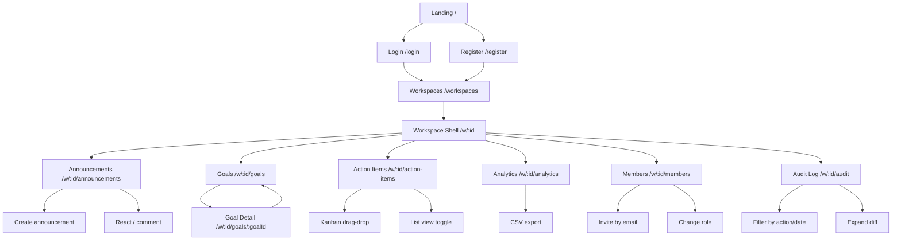

# Team Hub — QA Checklist & Demo Data

Full walkthrough for verifying every feature end-to-end. Follow the phases in order; each phase builds on state from the previous one.

---

## Demo Credentials

| Role | Email | Password | Name |
|------|-------|----------|------|
| **Admin** | `demo@team-hub.test` | `Demo1234` | Demo Admin |
| Member | `sarah.designer@team-hub.test` | `Demo1234` | Sarah Designer |
| Member | `jamie.dev@team-hub.test` | `Demo1234` | Jamie Developer |

---

## What the Seed Creates

**Workspace:** `Acme Product Launch`

### Goals (3)
| Title | Owner | Status | Due |
|-------|-------|--------|-----|
| Ship v2 product launch | Demo Admin | ON_TRACK | +45 days |
| Refresh design system | Sarah Designer | AT_RISK | +20 days |
| Cut error rate by 50% | Jamie Developer | DRAFT | +75 days |

### Milestones
| Goal | Milestone | Progress |
|------|-----------|----------|
| Ship v2 | Beta release | 100% |
| Ship v2 | Marketing site live | 60% |
| Ship v2 | GA rollout | 15% |
| Refresh design | Token audit | 80% |
| Refresh design | Component migration | 35% |
| Cut error rate | Sentry triage | 0% |

### Action Items (6, 2 overdue)
| Title | Assignee | Priority | Status | Due |
|-------|----------|----------|--------|-----|
| Write launch announcement copy | Jamie Dev | HIGH | IN_PROGRESS | +5 days |
| Final hero illustration | Sarah | MEDIUM | REVIEW | +2 days |
| Migrate Button + Card to v4 tokens | Sarah | MEDIUM | DONE | -3 days ✅ |
| Fix focus-ring regression in dark mode | Jamie Dev | **URGENT** | TODO | **-2 days ⚠️ overdue** |
| Backfill Sentry source maps for v1 | Demo Admin | HIGH | IN_PROGRESS | **-7 days ⚠️ overdue** |
| Schedule the launch retro | Jamie Dev | LOW | TODO | +60 days |

### Announcements (2)
| Title | Author | Pinned | Reactions |
|-------|--------|--------|-----------|
| Welcome to Acme Product Launch | Demo Admin | 📌 Yes | 🚀×2, ❤️×1 |
| Design system migration update | Sarah Designer | No | 👍×2 |

### Notifications (1 unread)
- **Demo Admin** has 1 unread `@mention` from Sarah in the pinned announcement comment.

---

## Navigation Flowchart

---

## Step-by-Step Test Walkthrough

---

### Phase 1 — Landing Page

| Step | Action | Expected |
|------|--------|----------|
| 1.1 | Open `http://localhost:3000` | Preloader shows (bunny hops ≥1 cycle) then fades |
| 1.2 | Watch the landing page load | GSAP hero animates in: logo → title → subtitle → CTAs → feature cards (staggered) |
| 1.3 | Toggle dark mode (top-right or `⌘K`) | Aurora changes colour, all tokens flip to dark palette |
| 1.4 | Click **Sign in** or **Get started** | Bunny appears on transition overlay, page slides in from right |

---

### Phase 2 — Auth

| Step | Action | Expected |
|------|--------|----------|
| 2.1 | Go to `/register` | Aurora background visible behind form card |
| 2.2 | Register a new user (any email) | Redirects to `/workspaces`; can optionally create a workspace |
| 2.3 | Log out (sidebar footer or `⌘K → Log out`) | Redirects to `/login` |
| 2.4 | Go to `/login`, enter `demo@team-hub.test` / `Demo1234` | Redirects to `/workspaces` |
| 2.5 | Try wrong password | Red error banner: "Invalid credentials" |
| 2.6 | Submit empty form | Inline validation errors appear under each field |

---

### Phase 3 — Workspaces List

| Step | Action | Expected |
|------|--------|----------|
| 3.1 | After login | `/workspaces` shows **Acme Product Launch** card |
| 3.2 | Click the workspace card | Enters workspace shell `/w/:id/announcements` |
| 3.3 | Click **+ New workspace** | Form to create a new workspace |

---

### Phase 4 — Workspace Shell

| Step | Action | Expected |
|------|--------|----------|
| 4.1 | Check sidebar | Shows: Announcements, Goals, Action Items, Analytics, Members, Audit Log |
| 4.2 | Check top bar | Workspace name, theme toggle, notification bell (badge = **1**), avatar |
| 4.3 | Click notification bell | Dropdown shows mention from Sarah: "can you double-check the rollout date…" |
| 4.4 | Click the notification | Marks as read, badge disappears, navigates to announcement |
| 4.5 | Press `⌘K` (Mac) or `Ctrl+K` (Win) | Command palette opens |
| 4.6 | Type `goals` in palette | Filters to Goals nav item |
| 4.7 | Press `Escape` | Palette closes |
| 4.8 | Check sidebar presence dots | 3 members listed (online dot appears for active sessions) |

---

### Phase 5 — Announcements

| Step | Action | Expected |
|------|--------|----------|
| 5.1 | Navigate to **Announcements** | 2 announcements; "Welcome to Acme…" is pinned at top |
| 5.2 | Check reactions on pinned post | 🚀 shows count 2, ❤️ shows count 1 |
| 5.3 | Click 🚀 to toggle reaction | Count decreases (optimistic); click again → count increases |
| 5.4 | Click 👍 on the second announcement | Count increases optimistically |
| 5.5 | Click into pinned announcement | Expands; body text visible with rich formatting (bold, list) |
| 5.6 | Read the comment | Sarah's @mention of Demo Admin is visible |
| 5.7 | Type a reply in the comment box | Text appears; submit → new comment appears (auto-animate) |
| 5.8 | Click **+ New Announcement** | Rich-text editor (Tiptap) opens |
| 5.9 | Write a heading + paragraph + bullet list | Toolbar: Bold / Italic / Heading / List / Code work |
| 5.10 | Submit | New announcement slides in at top of list |

---

### Phase 6 — Goals

| Step | Action | Expected |
|------|--------|----------|
| 6.1 | Navigate to **Goals** | 3 goals with status badges (ON_TRACK, AT_RISK, DRAFT) |
| 6.2 | Check "Refresh design system" | Status badge is **AT_RISK** (amber) |
| 6.3 | Click any goal | Opens goal detail page |
| 6.4 | Check milestones section | Progress bars visible; "Beta release" = 100% filled |
| 6.5 | Click a status pill (e.g. ON_TRACK → AT_RISK) | Status updates optimistically |
| 6.6 | Edit a milestone progress bar | Drag or type new % → updates immediately |
| 6.7 | Scroll activity feed | Shows past updates |
| 6.8 | Post a goal update | Text field → submit → new entry slides in at top |
| 6.9 | Click **Load more** at bottom | Cursor-paged older updates load |
| 6.10 | Go back to goals list | Browser back or sidebar link |
| 6.11 | Create a new goal | Fill title, description, due date → appears in list |

---

### Phase 7 — Action Items (Kanban)

| Step | Action | Expected |
|------|--------|----------|
| 7.1 | Navigate to **Action Items** | Kanban with 4 columns: TODO / IN_PROGRESS / REVIEW / DONE |
| 7.2 | Check overdue cards | "Fix focus-ring…" and "Backfill Sentry…" have red overdue badge |
| 7.3 | Drag a card to a different column | Card moves **immediately** (optimistic); column counts update |
| 7.4 | On bad connection (throttle in DevTools) → drag fails | Card snaps back to original column + toast error |
| 7.5 | Click the **List** toggle (top-right) | Switches to list view; persists on refresh |
| 7.6 | Click the **Board** toggle | Back to kanban |
| 7.7 | Filter by assignee → select **Jamie Developer** | Only Jamie's items visible |
| 7.8 | Filter by priority → **URGENT** | Only urgent items |
| 7.9 | Type in search box | Items filter in real time |
| 7.10 | Click **+ New item** | Dialog opens; fill title, assignee, priority, due date |
| 7.11 | Submit new item | Appears in correct column immediately |
| 7.12 | Click item to edit | Dialog pre-fills; save → card updates in place |

---

### Phase 8 — Analytics

| Step | Action | Expected |
|------|--------|----------|
| 8.1 | Navigate to **Analytics** | Stat cards: Total items (6), On-time %, Completion rate, Goal count |
| 8.2 | Check the line chart | Weekly completion trend visible |
| 8.3 | Check top contributors | Jamie and Sarah ranked by items completed/assigned |
| 8.4 | Click **Export items CSV** | CSV file downloads with all action items |
| 8.5 | Click **Export goals CSV** | CSV of goals |
| 8.6 | Click **Export audit CSV** (admin only) | Only visible as Demo Admin; downloads audit log |
| 8.7 | Log in as `sarah.designer@…` and check analytics | Audit export button **not visible** (member, not admin) |

---

### Phase 9 — Members

| Step | Action | Expected |
|------|--------|----------|
| 9.1 | Navigate to **Members** | 3 members: Demo Admin (ADMIN), Sarah Designer (MEMBER), Jamie Developer (MEMBER) |
| 9.2 | Hover any row | Remove button appears |
| 9.3 | Change Sarah's role to ADMIN | Dropdown → confirm → badge updates |
| 9.4 | Change back to MEMBER | Same flow |
| 9.5 | Click **Invite member** | Dialog opens with email field |
| 9.6 | Enter a new email and submit | Invitation token shown (copy it) |
| 9.7 | Open `/invite/:token` in a new incognito window | Register page pre-fills or join flow |
| 9.8 | Check **Pending invitations** section | Shows the invite you just sent with Revoke button |
| 9.9 | Click **Revoke** | Invitation disappears |
| 9.10 | Check presence dots | Active users have a green dot |

---

### Phase 10 — Audit Log

| Step | Action | Expected |
|------|--------|----------|
| 10.1 | Navigate to **Audit Log** | Chronological list of every action (goal create, item update, reaction, etc.) |
| 10.2 | Filter by **Action** → `goal.created` | Only goal creation events |
| 10.3 | Filter by **Entity type** → `actionItem` | Only action item events |
| 10.4 | Filter by **Actor** → select Demo Admin | Only Demo Admin's actions |
| 10.5 | Set **From date** to today | Only today's events |
| 10.6 | Click **Expand** on any update event | Shows before/after JSON diff |
| 10.7 | Click **Export CSV** | Downloads filtered audit log |
| 10.8 | Log in as **Sarah** and navigate to Audit Log | Visible (all members can view) |

---

### Phase 11 — Realtime (Presence + Live Updates)

Requires two browser windows logged in as different users.

| Step | Action | Expected |
|------|--------|----------|
| 11.1 | Open Window A as `demo@team-hub.test` | Normal login |
| 11.2 | Open Window B (incognito) as `sarah.designer@…` | Same workspace |
| 11.3 | In Window B, navigate to the workspace | Window A's Members sidebar shows Sarah online (green dot) |
| 11.4 | In Window A, create a new announcement | Window B sees it appear **without refresh** |
| 11.5 | In Window B, react to the announcement | Window A's reaction count updates live |
| 11.6 | In Window A, drag a kanban card | Window B sees the column update live |
| 11.7 | In Window B, post a comment that @mentions Demo Admin | Window A's notification bell badge increments live |
| 11.8 | Close Window B | Sarah's green dot disappears from Window A's sidebar |

---

### Phase 12 — Avatar Upload

| Step | Action | Expected |
|------|--------|----------|
| 12.1 | Click avatar in top-right of shell | Profile menu appears |
| 12.2 | Click **Change avatar** | File picker opens |
| 12.3 | Select a JPG/PNG under 2 MB | Uploads to Cloudinary; avatar updates everywhere |
| 12.4 | Try a file over 2 MB or a PDF | Error toast: file rejected |

> **Note:** Requires `CLOUDINARY_*` env vars. Without them, returns `503 CLOUDINARY_NOT_CONFIGURED`.

---

### Phase 13 — Polish & Animations

| Step | Action | Expected |
|------|--------|----------|
| 13.1 | Hard-refresh any page | Bunny preloader hops ≥1 full cycle then fades out |
| 13.2 | Navigate between any two pages | Overlay appears with mini hopping bunny, slides away revealing new page |
| 13.3 | Switch between dark and light mode | Aurora blobs change (blue/cyan/emerald palette) |
| 13.4 | Resize window to mobile (< 640px) | Sidebar collapses, layout stacks vertically |
| 13.5 | Enable `prefers-reduced-motion` in OS | All animations disabled; transitions are instant |
| 13.6 | Press `⌘K` | Command palette slides in from top |
| 13.7 | Navigate via palette | Route changes with bunny transition |

---

### Phase 14 — API Docs

| Step | Action | Expected |
|------|--------|----------|
| 14.1 | Open `http://localhost:4000/api/docs` | Swagger UI shows all endpoints |
| 14.2 | Open `http://localhost:4000/health` | `{"ok": true, "uptime": ..., "env": "development"}` |

---

## Common Issues & Fixes

| Symptom | Likely Cause | Fix |
|---------|-------------|-----|
| Blank page after login | Workspace not seeded | Run `pnpm --filter @team-hub/api db:seed` |
| "Invalid credentials" on correct password | DB not migrated | Run `pnpm --filter @team-hub/api db:migrate` first |
| Reactions/drag don't persist on refresh | API not running | Check `http://localhost:4000/health` |
| Realtime events not received | Socket not connected | Check browser console for `socket error`; verify `NEXT_PUBLIC_SOCKET_URL=http://localhost:4000` |
| Avatar upload fails | Cloudinary not configured | Add `CLOUDINARY_*` vars to `apps/api/.env` |
| Bunny doesn't show on reload | CSS not loaded (SSR mismatch) | Hard refresh with `Cmd+Shift+R` |
| Notification bell always shows 0 | Seed not run or run before migration | Re-run seed: `pnpm --filter @team-hub/api db:seed` |

---

## Scoring Reference

| Category | Points | Key things to verify |
|----------|--------|---------------------|
| Functionality | 25 | All 14 phases above pass |
| Code Quality | 20 | No console.logs, consistent naming, no commented-out code |
| Monorepo Architecture | 15 | `packages/schemas` shared, turbo.json pipeline, ESM backend |
| UI/UX | 15 | Preloader, bunny transitions, aurora, dark mode, responsive |
| Advanced Features | 10 | Optimistic UI (drag snap-back on fail), Audit log |
| Performance | 10 | Pagination on all lists, cursor pagination on activity feed |
| Documentation | 5 | README, DEPLOY.md, ARCHITECTURE.md, CLAUDE.md |
| Bonus | 10 | ⌘K palette, dark mode, avatar upload, Swagger docs |

**Total: 100 + 10 bonus**
